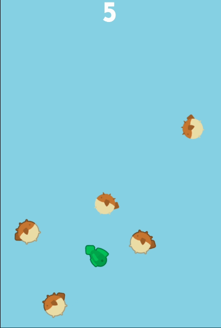

# Puffer Pester

A mini game where you must swim as long as possible and avoid touching the puffer fish!

## [Play](https://heidi-negrete.github.io/puffer-pester/)

## To dos:

- Before game ends, add death animation:  
  Blood particles on death from a marker2D on player position and run death animation slowly.
- Add increasing difficulty mechanics:
  Currents that randomly spawn, move either up or down or left and right in small streams across the screen that increase your speed while you’re in them.
- Sharks that spawn occasioinally and actively chase until caught in current.
- Rare swarms of baby puffers
- Tweak player movement so that its direction doesn't snap back to 0,0 when input released and add tiny drift in the direction it was moving before input released.
- Add cute google eyes onto player
